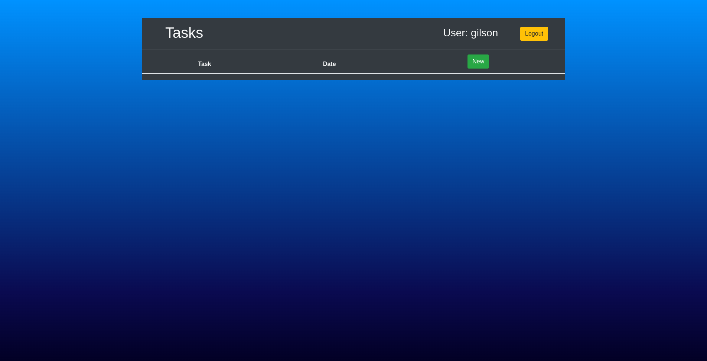

# Todo App - Web

Todo app using django 3, web version of [Todo App - Desktop](https://github.com/gilsongindrejr/TodoApp-Desktop).

# Table of Contents
- [Todo App - Web](#todo-app---web)
- [Table of Contents](#table-of-contents)
  - [About the project](#about-the-project)
    - [Features](#features)
    - [Build with](#build-with)
  - [Getting started](#getting-started)
    - [Create the virtual enviroment](#create-the-virtual-enviroment)
    - [Activate the virtual enviroment](#activate-the-virtual-enviroment)
    - [Install requirements](#install-requirements)
    - [Migrate the database](#migrate-the-database)
    - [Run server](#run-server)
    - [The server will be initiated on port 8000 - access http://127.0.0.1:8000](#the-server-will-be-initiated-on-port-8000---access-http1270018000)
  - [Usage](#usage)
    - [Create an account](#create-an-account)
    - [Login](#login)
    - [Create a task](#create-a-task)
  - [Testing](#testing)
      - [Run tests and show coverage](#run-tests-and-show-coverage)
## About the project

Project made to learn django and some other libs.

### Features
- Create tasks
- Set task date and time
- Update task
- Tasks are saved in registered account
   
### Build with
- [Django](https://www.djangoproject.com) - Web framework
- [Django bootstrap](https://django-bootstrap-v5.readthedocs.io/en/latest/) - Bootstrap for django
- [Django tests](https://docs.djangoproject.com/en/4.1/topics/testing/) - Django unit test tools
- [Model Mommy](https://model-mommy.readthedocs.io/en/latest/basic_usage.html) - (Deprecated) Fixtures for testing in django
- [Coverage](https://coverage.readthedocs.io/en/7.0.1/) - Tool for measuring code coverage


## Getting started

### Create the virtual enviroment
```
$ python -m venv venv
```

### Activate the virtual enviroment
```
$ source venv/bin/activate
```

### Install requirements
```
$ pip install -r requirements.txt
```

### Migrate the database
```
$ python manage.py migrate
```

### Run server
```
$ python manage.py runserver
```

### The server will be initiated on port 8000 - access <http://127.0.0.1:8000> 

## Usage

### Create an account


### Login


### Create a task

Click in ```New``` button to create a new task.



Type the task and date and then click ```Salvar```.


The task will be in home page, in here you can also edit and delete the task.


## Testing

The tests was made using django test module.

#### Run tests and show coverage
```
$ python manage.py test
```
